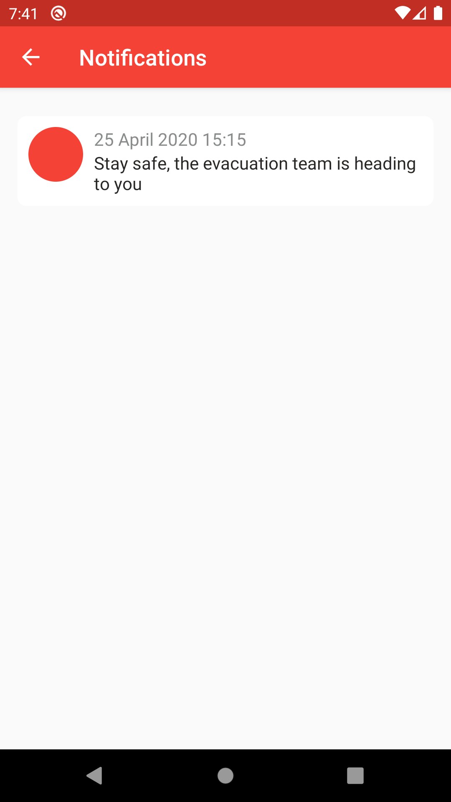

## COMEL App - Feel safe in emergency situation

COMEL (Casing SOS Smartphone Millenial) is a smartphone case that makes the location of its users can be detected by the evacuation team in emergency situation such as Natural Disaster.

### Components:
**COMEL Smartphone Case**
- Smartphone case
- RFID Tag chip

**COMEL Reader** - Used by the evacuation team
- RFID Reader
- Display LCD 5 Inch
- Raspberry Pi 3
- Powerbank

### Installation:
```
- git clone https://github.com/zulfahmisadrah/COMEL_App.git
- Put your **google-service.json** in **app** folder
- Build the app in Android Studio
```

## Screenshots
<p align="center">


</p>

### User
<p align="center">



</p>

### Rescuer
<p align="center">


</p>

